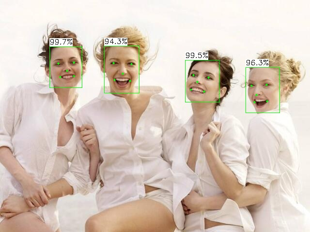
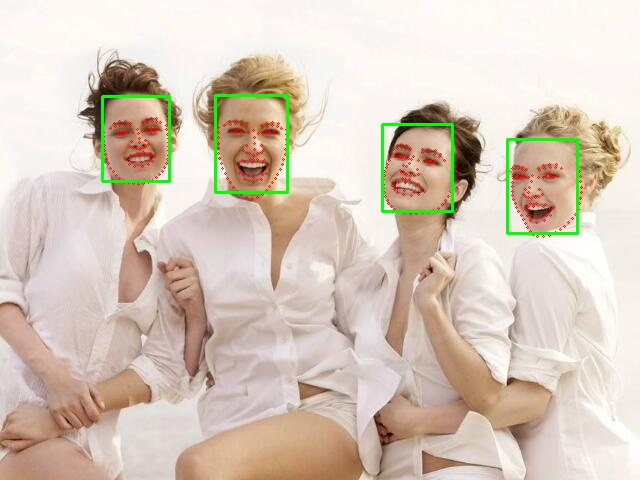
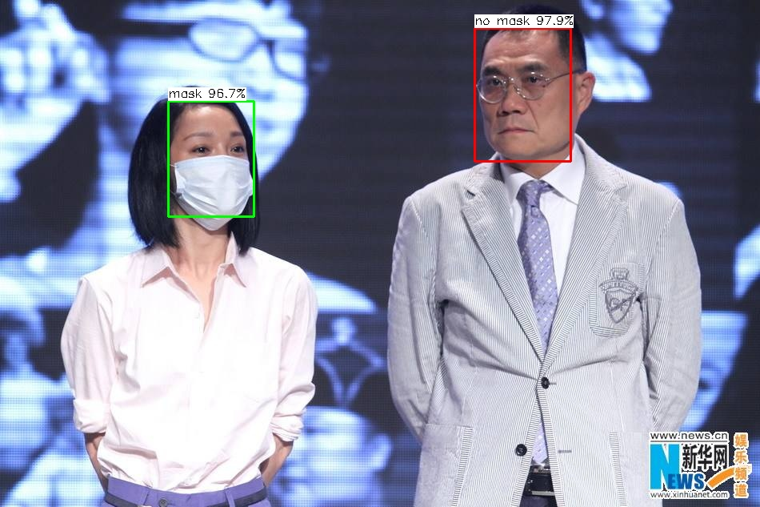
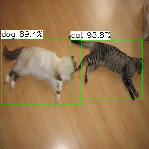
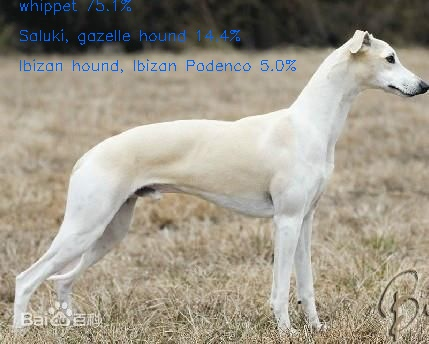
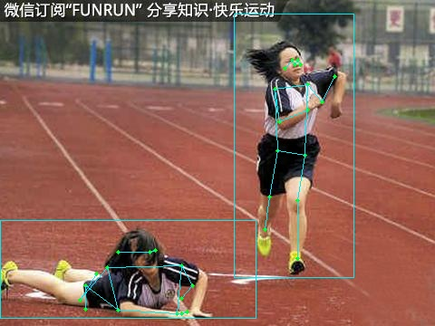
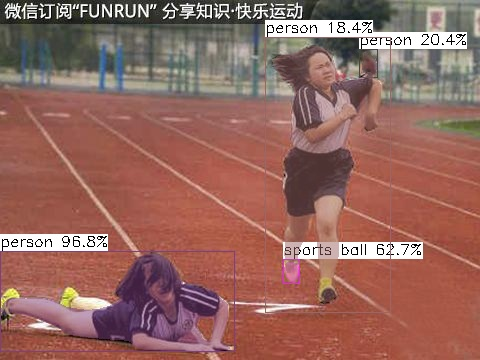
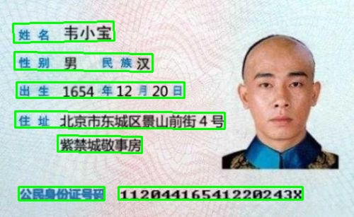

# VisionEngine

This is a simple visionEngine project, it depends on ncnn library and opencv

https://github.com/Tencent/ncnn

https://github.com/nihui/opencv-mobile

# How to use
## 1. download the models from baiduyun: [baidu](https://pan.baidu.com/s/1WguBm9JBUDEszCEi3W7E0A)(code: 8mhn) 
## 2. put models to directory: VisionEngine/data/models
## 3. https://github.com/Tencent/ncnn/releases
* Download ncnn-YYYYMMDD-platform-vulkan.zip or build ncnn for your platform yourself
* Extract ncnn-YYYYMMDD-platform-vulkan.zip into **lib/** and change the **ncnn_DIR** path to yours in **src/CMakeLists.txt**
## 4. https://github.com/nihui/opencv-mobile
* Download opencv-mobile-XYZ-platform.zip
* Extract opencv-mobile-XYZ-platform.zip into **lib/** and change the **OpenCV_DIR** path to yours in **src/CMakeLists.txt**
## 5. compile the project and enjoy!
```
>> cd VisionEngine && mkdir build && cd build && cmake .. && make -j4 
```
## 5. run the project:
```
>> cd src && ./face && ./object && ./classifier
```

## some notes
* All models are manually modified to accept dynamic input shape
* Most small models run slower on GPU than on CPU on Mobile platform, this is common
* FPS may be lower in dark environment because of longer camera exposure time

## 6. result
### face detector result:
### 
### face landmark result:
### 
### mask result:
### 
### object result:
### 
### classifier result:
### 
### pose result:
### 
### segment result:
### 
### ocr result:
### 

# 7. Deploy:
- [x] Linux deploy
- [x] Windows deploy
- [x] Aandroid deploy
- [x] IOS deploy

# 8. TODO:
- [x] optimize the speed by using block strategy
- [x] refactor the project

# 9. references
## https://github.com/Tencent/ncnn
## https://github.com/zuoqing1988/ZQCNN
## https://github.com/Charrin/RetinaFace-Cpp
## https://github.com/deepinsight/insightface
## https://github.com/Star-Clouds/centerface
## https://github.com/seetafaceengine/SeetaFace2
