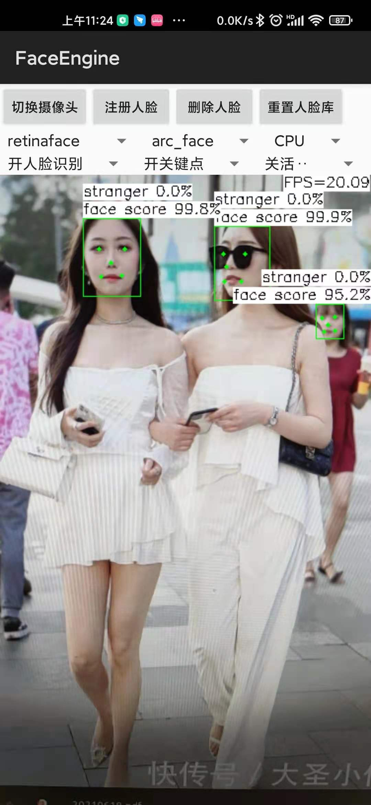

# ncnn-android-visionEngine

The visionEngine face detection, object classification and object detection.

This is a sample ncnn android project, it depends on ncnn library and opencv

https://github.com/Tencent/ncnn

https://github.com/nihui/opencv-mobile

## how to build and run
### step1
https://github.com/Tencent/ncnn/releases

* Download ncnn-YYYYMMDD-android-vulkan.zip or build ncnn for android yourself
* Extract ncnn-YYYYMMDD-android-vulkan.zip into **app/src/main/jni** and change the **ncnn_DIR** path to yours in **app/src/main/jni/CMakeLists.txt**

### step2
https://github.com/nihui/opencv-mobile

* Download opencv-mobile-XYZ-android.zip

* Extract opencv-mobile-XYZ-android.zip into **app/src/main/jni** and change the **OpenCV_DIR** path to yours in **app/src/main/jni/CMakeLists.txt**

### step3
* Download the models from baiduyun: [baidu](https://pan.baidu.com/s/1WguBm9JBUDEszCEi3W7E0A)(code: 8mhn) 
* Put models/face to directory: app/src/main/assets/models/face

### step4
* Compile VisionEngine library for android
[Please reference to scripts/android/README.md](../../scripts/android/README.md)
* Extract visionEngine-android-vulkan.zip or put visionEngine-android-vulkan into **app/src/main/jni** and change the **VISION_ENGINE_DIR** path to yours in **app/src/main/jni/CMakeLists.txt**

### step5
* Open this project with Android Studio, build it and enjoy!

## some notes
* Android ndk camera is used for best efficiency
* Crash may happen on very old devices for lacking HAL3 camera interface
* All models are manually modified to accept dynamic input shape
* Most small models run slower on GPU than on CPU, this is common
* FPS may be lower in dark environment because of longer camera exposure time

## screenshot

